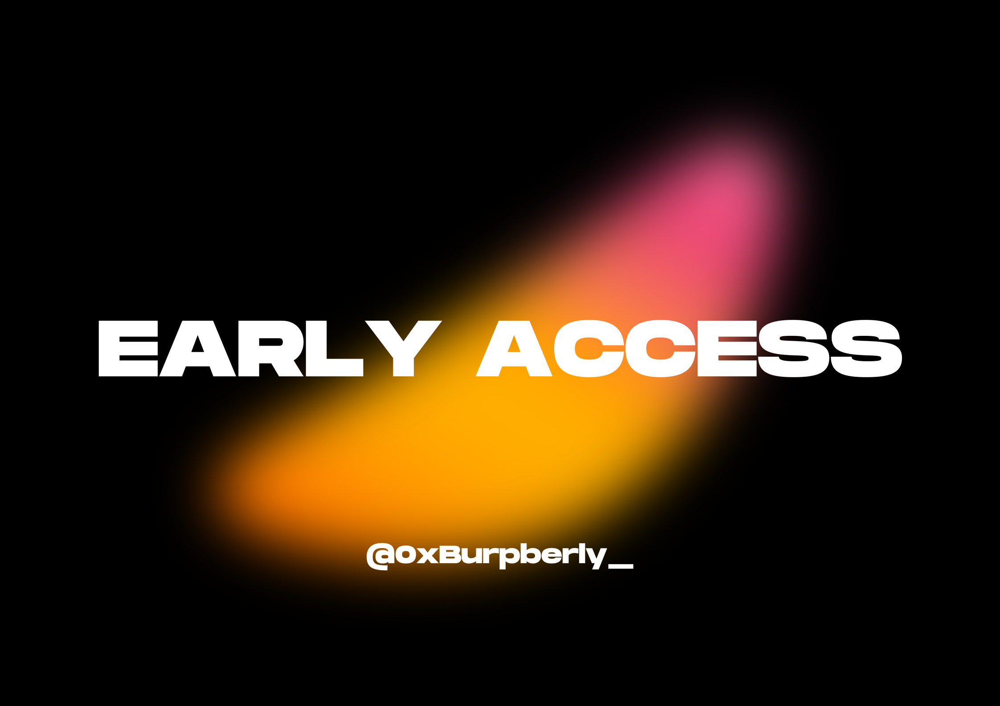

# Early Access

A list of your most early alphas in the crypto space.

##  Waitlists
1. [Manifestios](https://www.manifestios.com/). New primitive at the app layer, for iOS only

## Notifs on
1. [Tempo](https://x.com/tempo). Stripe's L1
2. [Republic](https://x.com/RepublicAI_IO). L1 Blockchain for AI Applications. **Discord now live**
3. [stardotfun](https://x.com/stardotfun). First livestreamed fundraising event. Next one on **September 9th 10:30AM EST**
4. [Vigil labs](https://x.com/vigillabs). Applied research lab building proprietary systems for trading.
5. [Wildcat Labs](https://x.com/WildcatFi). Configurable undercollaterised credit. A recent **[$3.5M](https://cryptorank.io/ico/wildcat-labs)** raise with a valuation of $35M

## Guides
Linked and hand-crafted
1. [octra](https://x.com/octra). Universal encrypted compute - privacy tech.

   Got a bunch of active testnet tasks from July which is just interacting with their deployed contracts. 
   
   It's easy to do and won't take more than a few minutes. The team was kind enough to link a tweet of all the tasks so far and you can find them [here](https://x.com/octra/status/1951016001530896559)

   I'll just link the relevant github repositories
   
   wallet gen - https://github.com/octra-labs/wallet-gen

   octra pre-client - https://github.com/octra-labs/octra_pre_client

   osc01 test - https://github.com/octra-labs/ocs01-test (to test math contract)

2. [Zama](https://x.com/zama_fhe). Fully Homormophic Encryption (FHE) tech. 
    
    Very bullish on this one, team and their execution. There are no click guides. The best way to contribute is to take a look at their creator program, which just recently launched and is giving away $53,000 in reward pools or their developer program (if you're savvy) for either their monthly developer program or bounty programs.

    Lots of incentives to be had in both tracks, including their Zama OG NFT. Get on the Discord and start contributing.

    [Zama creator program](https://www.zama.ai/programs/creator-program)

    [Zama developer program](https://www.zama.ai/programs/developer-program)

3. [deBerry's](https://x.com/deberrys_xyz). Ecosystem project on Zama

    Best way to interact is get on their [Guild](https://guild.xyz/deberrys) and try to grab a code to become a beta tester. **First beta currently closed - more invites soon**

4. [VEX](https://x.com/Trade_VEX). Real-time verifiable exchange

    Sign up on the [testnet site](https://testnet.verifiable.exchange/) to get access before testnet-2 which is coming with more updates. 300 invites codes in this [tweet](https://x.com/Trade_VEX/status/1961144233391526238), keep an eye out on the X page for more

    It's another CLOB but I'm liking their execution so far (plus platform looks good). Team is web3 native from Celestia, Ren protocol, LI.FI and Aerius labs. They are building a CEX-like trading experience with DEX-level transparency with Celestia underneath. Should be fun, will keep an eye out for this one.

5. [Outcome markets](https://x.com/OutcomeMarketX). Prediction terminal on Hyperliquid

    Trading competition (testnet) to battletest their platform with a $20k+ prize pool. The competition resumes **Monday, Sep. 8 at 3PM GMT+1**. Exciting updates around HL aligned markets with [Project X](https://x.com/prjx_hl), [Kinetiq](https://x.com/prjx_hl) and $USDH (stablecoin on Hyperliquid)

    Also join Discord - https://discord.com/invite/outcome. Community is still pretty small and active